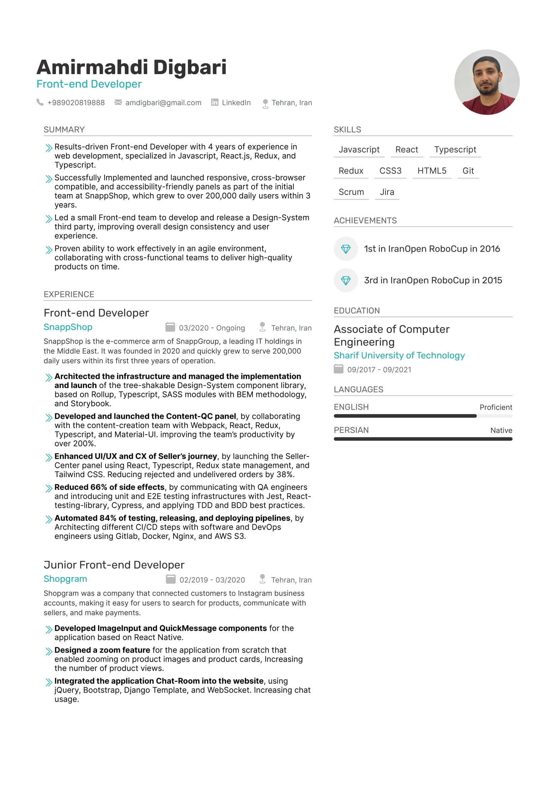

# cv-template

Simple Template to create CV.

### Usage

Open `index.js` and `styles.css` files in a text-editor and apply your changes at the beginning of the files. Change the avatar.

After that, open index.html file at any browser (preferably Chrome) and print the web page to a PDF file:)

### Result

